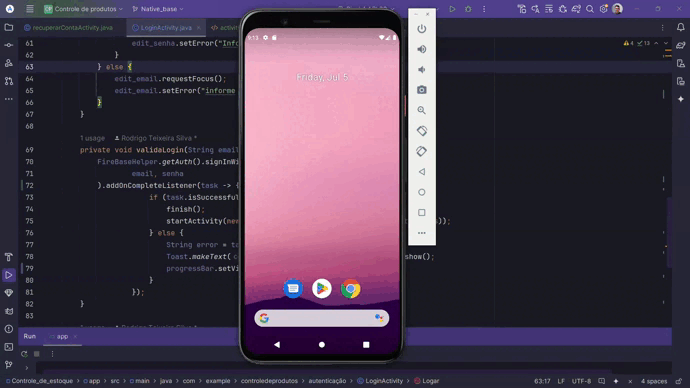

## 💻 Projeto

# Controle de estoque

## Sobre o projeto

Aplicação de controle de estoque com botões, menu, adição de produtos, toolbar personalizada, auteração de titulo, background, configuração de menus e tratativa de evento de click, banco de dados SQLite, Aprovação de login com native base e opções de deletar e editar produtos.

 **</>Codelink**.

Aplicação utilizando a linguagem java na pratica.

# Layout mobile

## Tela de login
<br>

<br>

## Tela de cadastro
<br>

<br>

## Funcionalidades tela de login, recuperar senha e cadastrar novo usuário
<br>

<br>

## tela Prinncipal
<br>

<br>
# Como executar o projeto

```bash
# clonar repositório
git clone https://github.com/rodrigo-teixeira-silva/App_lista_de_produtos.git

# gerar a build.
 run 'app'
```
## Aplicação Mobile
Pré-requisitos: android Studio e Sdk 33 

# Autor

Rodrigo Teixeira Silva


## [Linkedin](https://www.linkedin.com/in/rodrigo-teixeira-silva/)

